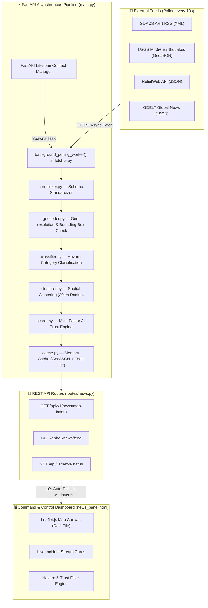

# NDMA DisasterLens AI v2.0 — System Architecture & Workflow Guide
**National Disaster Management Authority (NDMA), Pakistan**
*Multi-Hazard Command & Control System — Real-Time Disaster News Subsystem*

---

## 1. Overview & Core Purpose

The **NDMA DisasterLens AI v2.0 Live Disaster News Subsystem** is an automated, real-time news aggregation and intelligence engine. It continuously ingests multi-source disaster alerts (from GDACS, USGS, ReliefWeb, GDELT, and official RSS feeds), processes them through an AI classification and trust-scoring pipeline, clusters duplicate spatial reports, and serves live GeoJSON map layers to an interactive Leaflet command dashboard.

---

## 2. End-to-End Execution Flow



---

## 3. Module Breakdown & How Everything Works

### A. Async Ingestion Engine (`news_aggregator/fetcher.py`)
- **Background Worker**: Spawns an asynchronous event loop task on FastAPI startup (`lifespan`).
- **Concurrent Polling**: Uses `httpx.AsyncClient` to fetch data from GDACS, USGS, ReliefWeb, and GDELT simultaneously without blocking server endpoints.
- **Poll Interval**: Configured to cycle every 10 seconds.

### B. Data Normalization (`news_aggregator/normalizer.py`)
- Converts disparate incoming formats (RSS XML tags, USGS GeoJSON Feature properties, ReliefWeb API JSON trees) into a unified internal Python dictionary schema:
  - `title`, `description`, `published_at`, `lat`, `lng`, `location_name`, `source_name`, `source_url`, `media_url`.

### C. Geocoding & Boundary Resolution (`news_aggregator/geocoder.py`)
- Resolves location names to latitude and longitude.
- Applies geographical bounding box validation (`[23.5°N to 37.5°N, 60.5°E to 77.5°E]`) to highlight incidents within Pakistan and its immediate boundary region.

### D. AI Hazard Classification (`news_aggregator/classifier.py`)
- Evaluates title and description keywords against standardized hazard categories:
  - 🌊 **Flood** | 🌍 **Earthquake** | 🏔️ **Landslide** | 🧊 **GLOF** | ⛈️ **Severe Storm** | ❄️ **Avalanche**
- Assigns hazard emoji branding and color designators for map rendering.

### E. Spatial Deduplication & Clustering (`news_aggregator/clusterer.py`)
- Prevents map clutter by grouping duplicate reports referring to the same disaster event within a **30 km spatial radius** and temporal window.
- Consolidates multiple news outlets into a single cluster while recording source references.

### F. Multi-Factor Trust Scoring (`news_aggregator/scorer.py`)
Calculates a dynamic 0–100% Trust Score based on four weighted pillars:
1. **Source Authority (40%)**: Verified government/official agency feeds receive maximum weight (e.g., GDACS, USGS, NDMA).
2. **Multi-Source Verification (30%)**: Events reported by multiple independent outlets gain bonus trust points.
3. **Media Completeness (15%)**: Presence of verified high-res images, exact coordinates, and full descriptions.
4. **Temporal Freshness (15%)**: Recent reports retain higher scores; older items decay gracefully.

- **Trust Badges**:
  - `✅ VERIFIED` (Trust ≥ 80%) — Green pulsing marker
  - `⚠️ CROSS-CHECK` (Trust 50–79%) — Amber marker
  - `❌ UNVERIFIED` (Trust < 50%) — Red marker

### G. In-Memory Cache (`news_aggregator/cache.py`)
- Stores prepared GeoJSON FeatureCollections and sorted feed lists.
- Delivers sub-millisecond response times for frontend API calls (`/api/v1/news/map-layers`).

---

## 4. How to Run the System

### Running the Live Backend & Dashboard
1. Open a terminal in the backend directory:
   ```bash
   cd "/home/noor/Desktop/Code/NDMA proj 1/disasterlens-backend"
   ```
2. Run the application using the project Python virtual environment:
   ```bash
   venv/bin/python main.py
   ```
3. Open your browser and navigate to:
   - **Live News Dashboard (v2.0)**: [http://localhost:8000/](http://localhost:8000/) or [http://localhost:8000/news_panel.html](http://localhost:8000/news_panel.html)
   - **Interactive API Documentation**: [http://localhost:8000/api/docs](http://localhost:8000/api/docs)
   - **Legacy Prototype Dashboard**: [http://localhost:8000/legacy](http://localhost:8000/legacy)

---

## 5. Summary Table of Key API Endpoints

| Method | Endpoint | Description |
| :--- | :--- | :--- |
| `GET` | `/` or `/news_panel.html` | Live v2.0 Disaster News Dashboard UI |
| `GET` | `/api/v1/news/map-layers` | GeoJSON FeatureCollection endpoint for Leaflet map |
| `GET` | `/api/v1/news/feed` | Paginated incident cluster feed for sidebar panel |
| `GET` | `/api/v1/news/status` | Ingestion worker health, poll count & source stats |
| `POST` | `/api/v1/news/refresh` | Triggers an immediate re-ingestion cycle |
| `GET` | `/api/docs` | Interactive Swagger API Documentation |
